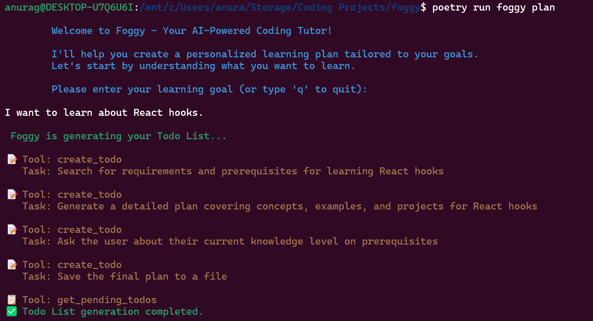
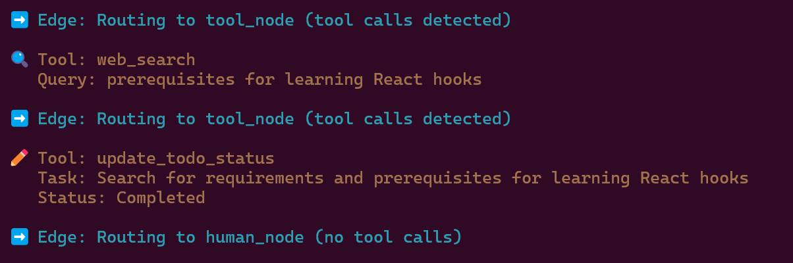
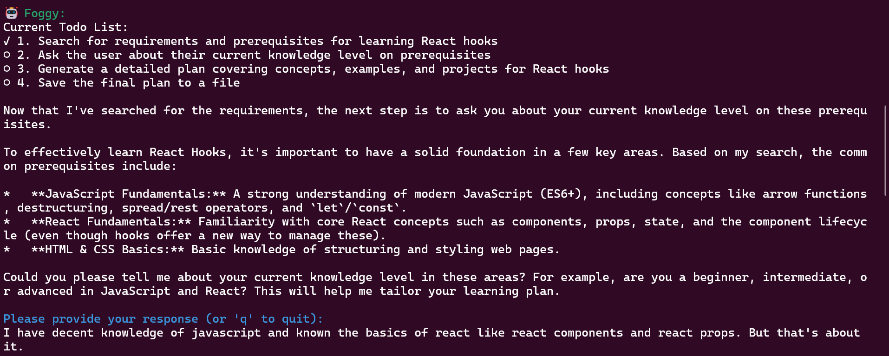
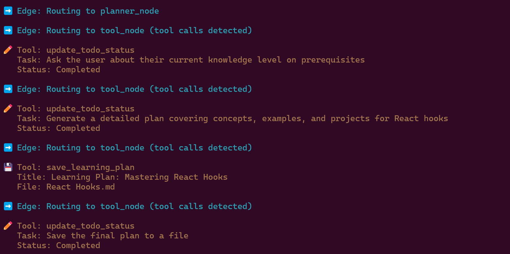
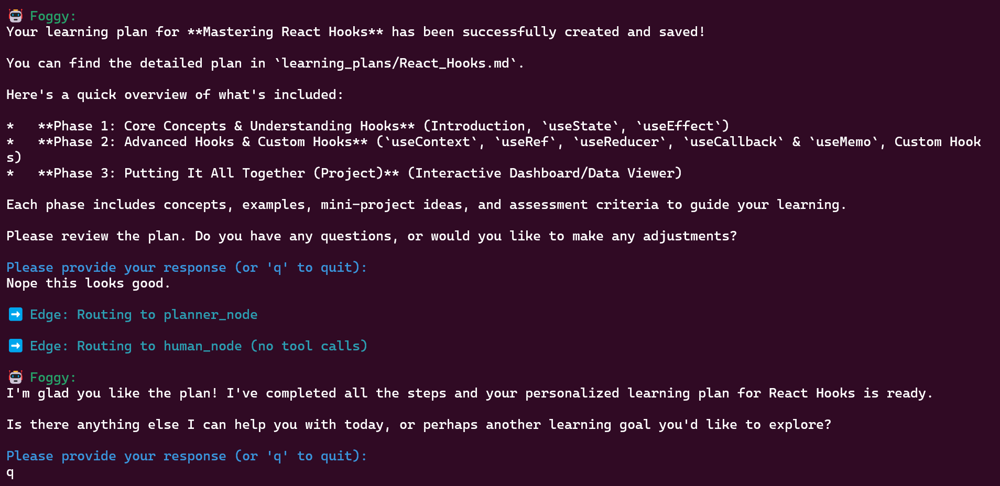
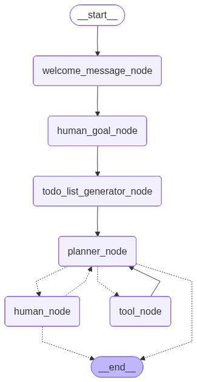

# Foggy - your personalized coding tutor

## Goal
With AI coding assistants and tools in the picture, the way a developer works has changed. This tool accounts for the shift in the way developers work.
1. **Syntax**: Important to understand the syntax of a language or a framework, but not necessarily memorize it.
2. **Language Concepts**: Crucial for us to understand all the basic concepts of a language or a framework. Helps write better prompts.
3. **Methods and method signatures**: Important to know the capabilities supported by the framework, library or language. Method signatures not essential.
4. **Design Patterns**: Essential to know the common design patterns of a language to help solve a problem in a cleaner, more structured manner.
5. **Project Based Learning**: The approach is to build projects to learn, even if it's as small as a hello world program.

## Features

### Plan Mode (Completed ✓)
Generate personalized learning plans based on your goals and prerequisites.

### Teach Mode (In Progress 🚧)
Interactive teaching sessions with adaptive content delivery.

### Evaluate Mode (In Progress 🚧)
Assess your progress and understanding of concepts.

## Installation

```bash
# Clone the repository
git clone https://github.com/yourusername/foggy.git
cd foggy

# Install dependencies
poetry install

# Setup environment variables
cp .env-template .env
# Add your GOOGLE_API_KEY, GEMINI_MODEL, and TAVILY_API_KEY to .env
```

## Usage

```bash
# Generate a learning plan
poetry run foggy plan

# Interactive teaching (coming soon)
poetry run foggy teach

# Evaluate progress (coming soon)
poetry run foggy evaluate
```

## Plan Flow - User Journey

The plan mode creates an adaptive learning plan through an interactive conversation. Here's how it works:

### 1. Todo Generation


Foggy analyzes your learning goal and generates an initial set of todos/topics to cover. This breaks down your learning objective into manageable chunks.

### 2. Web Search for Current Information


The system uses web search tools to gather up-to-date information about the topics, ensuring the learning plan reflects current best practices and resources.

### 3. Understanding Your Knowledge Level


Through interactive questions, Foggy assesses your current knowledge level and prerequisites to tailor the learning path to your needs.

### 4. Completing Remaining Todos


Foggy systematically works through the remaining todos, structuring content for each topic in your learning plan.

### 5. Final Learning Plan


You receive a comprehensive, personalized learning plan saved to a markdown file, complete with concepts, examples, and project ideas.

For example: [Example learning plan](example_learning_plan/React_Hooks.md)

## LangGraph Architecture

Foggy uses LangGraph for orchestrating the planning workflow. The flow diagram below shows how different nodes interact in the planning flow:



### Flow Overview

1. **Welcome Message Node**: Greets the user and explains the planning process.
2. **HumanGoal Node**: Captures the user's learning goal.
3. **AI: TodoListGenerator**: LLM generates initial task list based on the goal.
4..**AINode (Planner Agent)**: Core LLM that orchestrates the planning process.
5. **HumanNode**: Human in the loop for the whole planning process.
6. **ToolNode**: Provides access to:
   - Search (web_search)
   - Todo create/read operations
7. **Write Plan**: Updates and saves the learning plan to a markdown file.

### State Management

The graph uses a `PlanState` model with:
- `messages`: Annotated conversation history with `add_messages`
- `todo`: List of `Task` objects (name, isFinished)
- `finished`: Boolean flag indicating plan completion

## Project Structure

```
foggy/
├── foggy/
│   ├── cli/              # Click-based CLI
│   ├── langgraph/        # LangGraph orchestration
│   │   ├── models.py     # Pydantic state models
│   │   ├── tools.py      # LangGraph tools
│   │   └── graph.py      # Graph definition
│   ├── prompts.py        # Prompt templates
│   └── conversation/     # Response templates
├── docs/                 # Documentation and diagrams
├── tests/                # Test suite
└── pyproject.toml        # Poetry dependencies
```