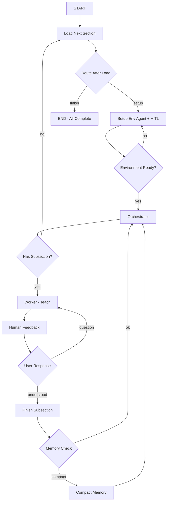

# Teach Mode Implementation Steps for Foggy

This document provides detailed implementation steps for the Teach Mode flow, organized sequentially with code examples from the LangGraph patterns reference.

---

## Step 1: Update save_learning_plan to Store Data in JSON Format ✅

### Goal
Create a structured learning plan generation system that uses LLM structured output to extract sections, subsections, and concepts from the planning conversation and saves it as JSON.

### Implementation Status: COMPLETED

This implementation uses a cleaner architecture with separation of concerns:

#### 1. **Pydantic Models** (`foggy/graph/models.py`)

```python
class Subsection(BaseModel):
    """Represents a subsection within a learning plan section."""
    id: str = Field(..., description="Unique identifier for the subsection")
    name: str = Field(..., description="Name of the subsection")
    description: str = Field(..., description="Description of what will be covered")
    concepts: List[str] = Field(default_factory=list, description="List of key concepts covered")
    isCompleted: bool = Field(default=False, description="Whether the subsection has been completed")

class Section(BaseModel):
    """Represents a section in the learning plan."""
    id: str = Field(..., description="Unique identifier for the section")
    name: str = Field(..., description="Name of the section")
    description: str = Field(..., description="Description of what will be covered")
    subsections: List[Subsection] = Field(default_factory=list, description="List of subsections")

class LearningPlan(BaseModel):
    """Represents a complete structured learning plan."""
    goal: str = Field(..., description="The learning goal")
    prerequisites: List[str] = Field(default_factory=list, description="List of prerequisites needed")
    sections: List[Section] = Field(default_factory=list, description="List of sections in the learning plan")
```

#### 2. **Simplified Tool** (`foggy/graph/tools.py`)

```python
@tool
def save_learning_plan() -> str:
    """Signal to save the learning plan.

    This tool is a marker that triggers the structure_learning_plan_node
    which handles the actual structuring and saving of the plan.
    """
    click.echo(click.style(f"\n💾 Tool: save_learning_plan", fg="yellow", bold=True))
    return "Request to save learning plan received. Processing..."
```

#### 3. **Structure Node with LLM** (`foggy/graph/nodes.py`)

```python
def structure_learning_plan_node(state: PlanState) -> PlanState:
    """Structure Learning Plan Node - converts plan text to structured JSON format.

    Uses LangGraph's create_agent with response_format for structured output.
    """
    # Extract conversation history
    conversation_text = ""
    for msg in state.get("messages", []):
        if hasattr(msg, "content"):
            # ... extract content

    # Create agent with structured output
    structure_agent = create_agent(
        model=_get_llm(),
        tools=[],
        response_format=LearningPlan,  # Structured output!
        system_prompt="You are an expert at structuring learning plans..."
    )

    # Get structured output from LLM
    result = structure_agent.invoke({
        "messages": [{"role": "user", "content": structure_prompt}]
    })

    structured_plan: LearningPlan = result["structured_response"]

    # Convert to JSON and save
    # ... (saves to learning_plan.json)
```

#### 4. **Updated Routing** (`foggy/graph/edges.py`)

```python
def maybe_route_to_tools(state: PlanState) -> Literal["tool_node", "structure_learning_plan_node", "human_node", "__end__"]:
    """Route to structure_learning_plan_node when save_learning_plan is called."""
    msgs = state.get("messages", [])
    if msgs and hasattr(msgs[-1], "tool_calls") and msgs[-1].tool_calls:
        for tool_call in msgs[-1].tool_calls:
            if tool_call.get("name") == "save_learning_plan":
                return "structure_learning_plan_node"
        return "tool_node"
    return "human_node"
```

#### 5. **Graph Integration** (`foggy/graph/graph.py`)

```python
from foggy.graph.nodes import structure_learning_plan_node

foggy_planner_graph_builder.add_node("structure_learning_plan_node", structure_learning_plan_node)
foggy_planner_graph_builder.add_edge("structure_learning_plan_node", "planner_node")
```

### Key Benefits

1. **Separation of Concerns**: Tool is just a marker; node handles the logic
2. **LLM Structured Output**: Uses LangGraph's `response_format` for reliable extraction
3. **Type Safety**: Pydantic models ensure data integrity
4. **Clean Flow**: Routing logic cleanly separates save from other tools

### JSON Structure Example

```json
{
  "goal": "Learn Python basics",
  "prerequisites": ["Text editor installed", "Python 3.8+ installed"],
  "sections": [
    {
      "id": "section_1",
      "name": "Variables and Data Types",
      "description": "Understanding Python variables and basic data types",
      "subsections": [
        {
          "id": "subsection_1_1",
          "name": "Integer and Float Variables",
          "description": "Numeric data types in Python",
          "concepts": ["int", "float", "type conversion"],
          "isCompleted": false
        },
        {
          "id": "subsection_1_2",
          "name": "String Variables",
          "description": "Working with text in Python",
          "concepts": ["str", "string methods", "f-strings"],
          "isCompleted": false
        }
      ]
    }
  ],
}
```

---

## Step 2: Implement TeachState Model

### Goal
Define the state schema for Teach mode with messages, section details, and subsection status tracking.

### Implementation

**File**: `foggy/langgraph/models.py`

```python
from typing import TypedDict, Annotated, Literal
from operator import add
from pydantic import BaseModel, Field

class SubsectionStatus(BaseModel):
    """Status of a single subsection."""
    id: str
    name: str
    description: str
    concepts: list[str]
    isCompleted: bool = False

class SectionInfo(BaseModel):
    """Information about current section."""
    id: str
    name: str
    description: str
    subsections: list[SubsectionStatus]

class TeachState(TypedDict):
    """State for Teach mode workflow."""
    # Message history (reducer: append)
    messages: Annotated[list, add]

    # Learning plan structure
    learning_plan: dict  # Full plan loaded from JSON
    goal: str  # Learning goal

    # Current section being taught
    current_section: SectionInfo | None
    current_subsection: SubsectionStatus | None

    # Progress tracking
    completed_sections: Annotated[list[str], add]  # Section IDs
    completed_subsections: Annotated[list[str], add]  # Subsection IDs

    # Session state
    environment_ready: bool
    session_id: str
    memory_compacted: bool

    # Control flow
    next_action: Literal["setup", "teach", "finish", "error"] | None


class EnvironmentSetupOutput(BaseModel):
    """Structured output from setup env agent."""
    dependencies_met: bool = Field(description="Are all dependencies installed?")
    files_created: list[str] = Field(description="List of files created during setup")
    ready_to_proceed: bool = Field(description="Is environment ready for teaching?")
    issues: list[str] = Field(default_factory=list, description="Any issues encountered")
    user_confirmation_needed: bool = Field(
        description="Does user need to perform manual steps?"
    )


class SubsectionCompletion(BaseModel):
    """Structured output when subsection is finished."""
    subsection_id: str = Field(description="ID of completed subsection")
    key_concepts: list[str] = Field(description="Main concepts covered")
    user_understood: bool = Field(description="User demonstrated understanding")
    next_action: Literal["continue", "review", "finish_section"] = Field(
        description="What to do next"
    )
```

**Update**: Add TeachState to exports

```python
# In foggy/langgraph/models.py
__all__ = [
    "Task",
    "PlanState",
    "TeachState",
    "SectionInfo",
    "SubsectionStatus",
    "EnvironmentSetupOutput",
    "SubsectionCompletion",
]
```

---

## Step 3: Implement Load Next Section Node

### Goal
Read the learning plan JSON and load the next incomplete section into state.

### Implementation

**File**: `foggy/langgraph/nodes.py` (create if doesn't exist)

```python
import json
from pathlib import Path
from foggy.langgraph.models import TeachState, SectionInfo, SubsectionStatus


def load_next_section_node(state: TeachState) -> dict:
    """Load next incomplete section from learning plan.

    This is the entry point for Teach mode. It reads the plan and
    initializes the current section to be taught.

    Args:
        state: Current teach state

    Returns:
        State updates with current section info
    """
    learning_plan = state.get("learning_plan")

    # If plan not loaded yet, load from file
    if not learning_plan:
        plan_path = Path("learning_plan.json")
        if not plan_path.exists():
            return {
                "next_action": "error",
                "messages": [{
                    "role": "system",
                    "content": "Error: No learning plan found. Please run 'foggy plan' first."
                }]
            }

        with open(plan_path, "r", encoding="utf-8") as f:
            learning_plan = json.load(f)

    completed_sections = state.get("completed_sections", [])

    # Find next incomplete section
    for section_data in learning_plan["sections"]:
        section_id = section_data["id"]

        if section_id not in completed_sections:
            # Create SectionInfo object
            subsections = [
                SubsectionStatus(
                    id=sub["id"],
                    name=sub["name"],
                    description=sub["description"],
                    concepts=sub.get("concepts", []),
                    isCompleted=sub.get("isCompleted", False)
                )
                for sub in section_data["subsections"]
            ]

            current_section = SectionInfo(
                id=section_id,
                name=section_data["name"],
                description=section_data["description"],
                subsections=subsections
            )

            return {
                "learning_plan": learning_plan,
                "goal": learning_plan.get("goal", ""),
                "current_section": current_section,
                "current_subsection": None,  # Will be set by orchestrator
                "next_action": "setup",
                "messages": [{
                    "role": "system",
                    "content": f"Starting section: {current_section.name}"
                }]
            }

    # All sections complete
    return {
        "next_action": "finish",
        "messages": [{
            "role": "system",
            "content": "🎉 Congratulations! You've completed all sections of your learning plan!"
        }]
    }


def route_after_load(state: TeachState) -> str:
    """Route after loading section."""
    next_action = state.get("next_action")

    if next_action == "setup":
        return "setup_env"
    elif next_action == "finish":
        return "__end__"
    else:
        return "error_handler"
```

---

## Step 4: Implement Setup Environment Agent

### Goal
Create an agent that analyzes section requirements and guides user through environment setup with HITL for confirmations.

### Implementation

**File**: `foggy/langgraph/tools.py` - Add file operation tools

```python
import os
from typing import Annotated
from langgraph.prebuilt import InjectedState


def read_file_tool(
    file_path: str,
    state: Annotated[dict, InjectedState],
) -> str:
    """Read contents of a file.

    Args:
        file_path: Path to file to read
        state: Injected graph state

    Returns:
        File contents or error message
    """
    try:
        with open(file_path, "r", encoding="utf-8") as f:
            return f.read()
    except FileNotFoundError:
        return f"Error: File not found: {file_path}"
    except Exception as e:
        return f"Error reading file: {str(e)}"


def write_file_tool(
    file_path: str,
    content: str,
    state: Annotated[dict, InjectedState],
) -> str:
    """Write content to a file.

    Args:
        file_path: Path to file to write
        content: Content to write
        state: Injected graph state

    Returns:
        Success message or error
    """
    try:
        # Create parent directories if needed
        os.makedirs(os.path.dirname(file_path) or ".", exist_ok=True)

        with open(file_path, "w", encoding="utf-8") as f:
            f.write(content)

        return f"Successfully wrote to {file_path}"
    except Exception as e:
        return f"Error writing file: {str(e)}"


def list_directory_tool(
    directory_path: str = ".",
    state: Annotated[dict, InjectedState] = None,
) -> str:
    """List contents of a directory.

    Args:
        directory_path: Path to directory
        state: Injected graph state

    Returns:
        Directory listing
    """
    try:
        items = os.listdir(directory_path)
        return "\n".join(sorted(items))
    except Exception as e:
        return f"Error listing directory: {str(e)}"
```

**File**: `foggy/langgraph/nodes.py` - Add setup environment node

```python
from langchain.agents import create_agent
from langchain.agents.middleware import HumanInTheLoopMiddleware
from langgraph.checkpoint.memory import InMemorySaver
from langgraph.types import Command, interrupt
from langchain_core.language_models import init_chat_model
from foggy.langgraph.tools import read_file_tool, write_file_tool, list_directory_tool
from foggy.langgraph.models import EnvironmentSetupOutput
import os


def setup_env_agent_node(state: TeachState) -> dict:
    """Setup environment using agent with HITL for file operations.

    This agent:
    1. Analyzes section requirements
    2. Checks current environment
    3. Creates necessary files with user approval
    4. Returns structured output about readiness
    """
    current_section = state.get("current_section")

    if not current_section:
        return {"next_action": "error"}

    # Initialize Gemini model
    model_name = os.getenv("GEMINI_MODEL", "gemini-2.0-flash-exp")
    model = init_chat_model(f"google_genai/{model_name}")

    # Create agent with HITL for write operations
    setup_agent = create_agent(
        model=model,
        tools=[read_file_tool, write_file_tool, list_directory_tool],
        middleware=[
            HumanInTheLoopMiddleware(
                interrupt_on={
                    "write_file_tool": True,  # Require approval for writes
                    "read_file_tool": False,  # Auto-approve reads
                    "list_directory_tool": False,  # Auto-approve listing
                }
            )
        ],
        system_prompt=f"""You are a teaching assistant helping set up the learning environment.

Current section: {current_section.name}
Description: {current_section.description}

Your tasks:
1. Check if necessary files/dependencies exist
2. Create example files or templates needed for this section
3. Guide the user through any manual setup steps

Be helpful and clear. Ask for user confirmation before making changes.""",
        checkpointer=InMemorySaver(),
    )

    # Prepare messages
    setup_messages = state.get("messages", []) + [{
        "role": "user",
        "content": f"Please help me set up the environment for: {current_section.name}"
    }]

    # Run agent
    config = {"configurable": {"thread_id": state.get("session_id", "default")}}
    result = setup_agent.invoke({"messages": setup_messages}, config)

    # Check for interrupts (HITL pauses)
    if "__interrupt__" in result:
        # Pause for user approval
        user_decision = interrupt(
            value={
                "message": "The setup agent wants to perform file operations. Please review and approve.",
                "interrupt": result["__interrupt__"]
            }
        )

        # Resume with user decision
        result = setup_agent.invoke(
            Command(resume={"decisions": user_decision.get("decisions", [])}),
            config
        )

    # Ask user to confirm environment is ready
    user_confirmation = interrupt(
        value={
            "type": "confirmation",
            "message": "Have you completed any manual setup steps? Is your environment ready to proceed?",
            "options": ["Yes, ready to proceed", "No, need more help"]
        }
    )

    environment_ready = user_confirmation.get("choice") == "Yes, ready to proceed"

    return {
        "messages": result.get("messages", []),
        "environment_ready": environment_ready,
        "next_action": "teach" if environment_ready else "setup"
    }


def route_after_setup(state: TeachState) -> str:
    """Route after environment setup."""
    if state.get("environment_ready"):
        return "orchestrator"
    else:
        return "setup_env"  # Loop back for more help
```

---

## Step 5: Implement Orchestrator Node

### Goal
Orchestrator assigns subsections to worker nodes using the Send API.

### Implementation

**File**: `foggy/langgraph/nodes.py`

```python
from langgraph.types import Send, Command
from typing import Literal


def orchestrator_node(state: TeachState) -> Command[Literal["worker", "__end__"]]:
    """Orchestrator assigns subsections to worker.

    This node:
    1. Checks current section's subsections
    2. Finds next incomplete subsection
    3. Sends work to worker using Send API
    4. Or finishes section if all complete
    """
    current_section = state.get("current_section")
    completed_subsections = state.get("completed_subsections", [])

    if not current_section:
        return Command(goto="__end__")

    # Find next incomplete subsection
    for subsection in current_section.subsections:
        if subsection.id not in completed_subsections and not subsection.isCompleted:
            # Found next subsection to teach
            return Command(
                update={
                    "current_subsection": subsection,
                    "messages": [{
                        "role": "system",
                        "content": f"Starting subsection: {subsection.name}"
                    }]
                },
                goto="worker"
            )

    # All subsections in this section are complete
    return Command(
        update={
            "completed_sections": [current_section.id],
            "messages": [{
                "role": "system",
                "content": f"✓ Section completed: {current_section.name}"
            }]
        },
        goto="__end__"  # Will load next section or finish
    )
```

---

## Step 6: Implement Custom Edge from Orchestrator

### Goal
Route from orchestrator to worker, tools, or end based on state.

### Implementation

**File**: `foggy/langgraph/teach_graph.py` (to be created in Step 10)

```python
# This will be used when building the graph
from typing import Literal

def route_from_orchestrator(state: TeachState) -> Literal["worker", "__end__"]:
    """Route from orchestrator based on subsection availability."""
    current_subsection = state.get("current_subsection")

    if current_subsection:
        return "worker"
    else:
        return "__end__"
```

---

## Step 7: Implement Worker and Human Feedback Nodes

### Goal
Worker teaches the subsection using direct chat model, with human feedback loop for interaction.

### Implementation

**File**: `foggy/langgraph/nodes.py`

```python
from langchain_core.language_models import init_chat_model
from langchain_core.messages import HumanMessage, SystemMessage, AIMessage
from langgraph.types import interrupt


def worker_node(state: TeachState) -> dict:
    """Worker teaches a subsection using direct chat model.

    Flow:
    1. Get subsection to teach
    2. Generate teaching content using LLM
    3. Present to user with ability to ask questions
    4. Loop until user understands
    """
    current_subsection = state.get("current_subsection")
    messages = state.get("messages", [])

    if not current_subsection:
        return {"next_action": "error"}

    # Initialize Gemini model
    model_name = os.getenv("GEMINI_MODEL", "gemini-2.0-flash-exp")
    model = init_chat_model(f"google_genai/{model_name}")

    # Create teaching prompt
    system_prompt = f"""You are an expert programming tutor teaching: {current_subsection.name}

Description: {current_subsection.description}
Key concepts: {', '.join(current_subsection.concepts)}

Teaching approach:
1. Explain the concept clearly with examples
2. Provide code snippets the user can copy and try
3. Encourage hands-on practice
4. Be patient and answer questions thoroughly

Keep explanations concise but comprehensive. Use markdown for formatting."""

    # Generate teaching content
    teaching_messages = [
        SystemMessage(content=system_prompt)
    ] + messages + [
        HumanMessage(content=f"Please teach me about: {current_subsection.name}")
    ]

    response = model.invoke(teaching_messages)

    # Add response to messages
    new_messages = [AIMessage(content=response.content)]

    return {
        "messages": new_messages,
        "next_action": "human_feedback"
    }


def human_feedback_node(state: TeachState) -> dict:
    """Collect user feedback and handle questions.

    This node:
    1. Presents teaching content to user
    2. Asks if they understand or have questions
    3. Routes based on user response
    """
    current_subsection = state.get("current_subsection")

    # Pause for user interaction
    user_response = interrupt(
        value={
            "type": "feedback",
            "message": f"Teaching: {current_subsection.name}",
            "prompt": "Do you understand? Type your question or 'continue' to proceed.",
        }
    )

    user_input = user_response.get("text", "").strip().lower()

    if user_input in ["continue", "yes", "understood", "got it"]:
        # User understood, mark subsection complete
        return {
            "next_action": "finish_subsection",
            "messages": [{
                "role": "user",
                "content": "I understand, let's continue."
            }]
        }
    else:
        # User has a question, loop back to worker
        return {
            "next_action": "worker",  # Go back to worker to answer question
            "messages": [{
                "role": "user",
                "content": user_input
            }]
        }


def route_after_worker(state: TeachState) -> Literal["human_feedback", "finish_subsection"]:
    """Route after worker generates content."""
    next_action = state.get("next_action")

    if next_action == "human_feedback":
        return "human_feedback"
    elif next_action == "finish_subsection":
        return "finish_subsection"
    else:
        return "human_feedback"  # Default


def route_after_feedback(state: TeachState) -> Literal["worker", "finish_subsection"]:
    """Route after human feedback."""
    next_action = state.get("next_action")

    if next_action == "worker":
        return "worker"  # User has question, loop back
    elif next_action == "finish_subsection":
        return "finish_subsection"  # User understood
    else:
        return "worker"  # Default: assume question
```

---

## Step 8: Implement finish_subsection Tool and Custom Edge

### Goal
Create tool to mark subsection complete and update state, with routing logic.

### Implementation

**File**: `foggy/langgraph/tools.py`

```python
def finish_subsection_tool(
    subsection_id: str,
    state: Annotated[dict, InjectedState],
) -> str:
    """Mark a subsection as complete and update state.

    Args:
        subsection_id: ID of subsection to mark complete
        state: Injected graph state

    Returns:
        Success message
    """
    current_section = state.get("current_section")

    if not current_section:
        return "Error: No current section"

    # Find and mark subsection complete
    for subsection in current_section.subsections:
        if subsection.id == subsection_id:
            subsection.isCompleted = True
            break

    # Add to completed list
    completed = state.get("completed_subsections", [])
    if subsection_id not in completed:
        state.setdefault("completed_subsections", []).append(subsection_id)

    # Update learning plan JSON
    _update_plan_file(state)

    return f"✓ Subsection completed: {subsection_id}"


def _update_plan_file(state: dict) -> None:
    """Update the learning plan JSON file with progress."""
    learning_plan = state.get("learning_plan")
    completed_subsections = state.get("completed_subsections", [])

    if not learning_plan:
        return

    # Update completion status in plan
    for section in learning_plan["sections"]:
        for subsection in section["subsections"]:
            if subsection["id"] in completed_subsections:
                subsection["isCompleted"] = True

    # Save updated plan
    with open("learning_plan.json", "w", encoding="utf-8") as f:
        json.dump(learning_plan, f, indent=2, ensure_ascii=False)
```

**File**: `foggy/langgraph/nodes.py` - Add finish subsection node

```python
def finish_subsection_node(state: TeachState) -> dict:
    """Node to finish current subsection.

    This node:
    1. Calls finish_subsection_tool
    2. Checks if memory compaction needed
    3. Routes back to orchestrator for next subsection
    """
    current_subsection = state.get("current_subsection")

    if not current_subsection:
        return {"next_action": "error"}

    # Mark complete using tool
    result = finish_subsection_tool(current_subsection.id, state)

    messages = state.get("messages", [])

    # Check if memory compaction needed
    if len(messages) > 40:
        return {
            "next_action": "compact_memory",
            "messages": [{
                "role": "system",
                "content": result
            }]
        }
    else:
        return {
            "next_action": "orchestrator",
            "current_subsection": None,  # Clear current subsection
            "messages": [{
                "role": "system",
                "content": result
            }]
        }


def route_after_finish_subsection(state: TeachState) -> Literal["compact_memory", "orchestrator"]:
    """Route after finishing subsection."""
    next_action = state.get("next_action")

    if next_action == "compact_memory":
        return "compact_memory"
    else:
        return "orchestrator"
```

---

## Step 9: Implement Conversation Summarizer Tool

### Goal
Create custom tool that uses direct LLM call to summarize conversation history.

### Implementation

**File**: `foggy/langgraph/tools.py`

```python
from langchain_core.language_models import init_chat_model
from langchain_core.messages import HumanMessage, SystemMessage


def compact_conversation_memory(
    state: Annotated[dict, InjectedState],
    keep_last_n: int = 15,
) -> str:
    """Compact conversation memory using direct LLM call.

    Args:
        state: Injected graph state containing messages
        keep_last_n: Number of recent messages to keep unsummarized

    Returns:
        Status message
    """
    messages = state.get("messages", [])

    if len(messages) <= keep_last_n + 5:
        return "No compaction needed - conversation is still short"

    # Split messages
    old_messages = messages[:-keep_last_n]
    recent_messages = messages[-keep_last_n:]

    # Format conversation for summarization
    conversation_text = "\n".join([
        f"{msg.get('role', 'unknown')}: {msg.get('content', '')}"
        for msg in old_messages
    ])

    # Initialize Gemini for summarization (use flash for speed)
    model = init_chat_model("google_genai/gemini-2.0-flash-exp", temperature=0)

    # Create summarization prompt
    summary_prompt = f"""Summarize this teaching conversation between a tutor and student.

Focus on:
- Key concepts already covered
- Student's current understanding level
- Important context for continuing the session
- Any unresolved questions or confusion

Conversation to summarize:
{conversation_text}

Provide a concise summary that preserves essential teaching context."""

    # Generate summary
    summary_response = model.invoke([
        HumanMessage(content=summary_prompt)
    ])

    # Create summary message
    summary_message = {
        "role": "system",
        "content": f"[Previous Session Summary]\n{summary_response.content}"
    }

    # Update state with compacted messages
    state["messages"] = [summary_message] + recent_messages

    return f"Memory compacted: {len(old_messages)} messages summarized, {keep_last_n} recent messages retained"
```

**File**: `foggy/langgraph/nodes.py` - Add memory compaction node

```python
def compact_memory_node(state: TeachState) -> dict:
    """Node that performs memory compaction.

    This node:
    1. Calls compact_conversation_memory tool
    2. Updates messages in state
    3. Routes back to orchestrator
    """
    result = compact_conversation_memory(state, keep_last_n=15)

    return {
        "memory_compacted": True,
        "next_action": "orchestrator",
        "messages": state["messages"],  # Already updated by tool
    }
```

---

## Step 10: Build the Complete Teach Mode Graph

### Goal
Assemble all nodes into a complete LangGraph workflow.

### Implementation

**File**: `foggy/langgraph/teach_graph.py` (new file)

```python
"""Teach mode LangGraph workflow."""
from langgraph.graph import StateGraph, START, END
from langgraph.checkpoint.memory import InMemorySaver
from foggy.langgraph.models import TeachState
from foggy.langgraph.nodes import (
    load_next_section_node,
    route_after_load,
    setup_env_agent_node,
    route_after_setup,
    orchestrator_node,
    worker_node,
    human_feedback_node,
    route_after_worker,
    route_after_feedback,
    finish_subsection_node,
    route_after_finish_subsection,
    compact_memory_node,
)


def create_teach_graph():
    """Create the teach mode LangGraph workflow.

    Flow:
    START → Load Section → Setup Env → Orchestrator → Worker ↔ Human Feedback → Finish Subsection → [Memory Compact?] → Orchestrator → ...
    """
    # Create graph
    workflow = StateGraph(TeachState)

    # Add nodes
    workflow.add_node("load_section", load_next_section_node)
    workflow.add_node("setup_env", setup_env_agent_node)
    workflow.add_node("orchestrator", orchestrator_node)
    workflow.add_node("worker", worker_node)
    workflow.add_node("human_feedback", human_feedback_node)
    workflow.add_node("finish_subsection", finish_subsection_node)
    workflow.add_node("compact_memory", compact_memory_node)

    # Add edges
    workflow.add_edge(START, "load_section")

    # After load: route to setup or end
    workflow.add_conditional_edges(
        "load_section",
        route_after_load,
        ["setup_env", "__end__", "error_handler"]
    )

    # After setup: route to orchestrator or loop back
    workflow.add_conditional_edges(
        "setup_env",
        route_after_setup,
        ["orchestrator", "setup_env"]
    )

    # Orchestrator uses Command to route directly (no conditional edge needed)
    # It routes to "worker" or END

    # After worker: route to human_feedback
    workflow.add_conditional_edges(
        "worker",
        route_after_worker,
        ["human_feedback", "finish_subsection"]
    )

    # After human_feedback: route to worker (question) or finish_subsection (understood)
    workflow.add_conditional_edges(
        "human_feedback",
        route_after_feedback,
        ["worker", "finish_subsection"]
    )

    # After finish_subsection: route to compact_memory or orchestrator
    workflow.add_conditional_edges(
        "finish_subsection",
        route_after_finish_subsection,
        ["compact_memory", "orchestrator"]
    )

    # After compact_memory: go back to orchestrator
    workflow.add_edge("compact_memory", "orchestrator")

    # Compile with checkpointer
    app = workflow.compile(checkpointer=InMemorySaver())

    return app


# For visualization
if __name__ == "__main__":
    graph = create_teach_graph()

    # Save graph visualization
    try:
        from IPython.display import Image
        img = Image(graph.get_graph().draw_mermaid_png())
        with open("teach_mode_graph.png", "wb") as f:
            f.write(img.data)
        print("Graph visualization saved to teach_mode_graph.png")
    except Exception as e:
        print(f"Could not generate visualization: {e}")
        # Print mermaid text instead
        print("\nMermaid diagram:")
        print(graph.get_graph().draw_mermaid())
```

---

## Step 11: Integrate with CLI

### Goal
Add teach command to CLI that initializes and runs the teach graph.

### Implementation

**File**: `foggy/cli/commands.py`

```python
import click
from foggy.langgraph.teach_graph import create_teach_graph
from foggy.langgraph.models import TeachState
import uuid


@cli.command()
@click.option("--session-id", default=None, help="Resume existing session")
def teach(session_id: str | None):
    """Start interactive teaching session.

    This command loads your learning plan and guides you through
    each section with interactive teaching and exercises.
    """
    # Create graph
    graph = create_teach_graph()

    # Generate or use existing session ID
    if not session_id:
        session_id = str(uuid.uuid4())
        click.echo(f"Starting new session: {session_id}")
    else:
        click.echo(f"Resuming session: {session_id}")

    # Configuration for persistence
    config = {
        "configurable": {
            "thread_id": session_id
        }
    }

    # Initialize state
    initial_state = {
        "messages": [],
        "session_id": session_id,
        "completed_sections": [],
        "completed_subsections": [],
        "environment_ready": False,
        "memory_compacted": False,
    }

    click.echo("\n🎓 Welcome to Foggy Teach Mode!")
    click.echo("=" * 50)

    try:
        # Run graph with streaming
        for event in graph.stream(initial_state, config, stream_mode="values"):
            # Display messages
            if "messages" in event:
                for msg in event["messages"]:
                    role = msg.get("role", "")
                    content = msg.get("content", "")

                    if role == "system":
                        click.echo(f"\n{content}")
                    elif role == "assistant":
                        click.echo(f"\n📚 Teacher: {content}")
                    elif role == "user":
                        click.echo(f"\n👤 You: {content}")

            # Handle interrupts (HITL pauses)
            if "__interrupt__" in event:
                # This will be handled by the interrupt() calls in nodes
                pass

    except KeyboardInterrupt:
        click.echo("\n\nSession paused. Resume with: foggy teach --session-id " + session_id)
    except Exception as e:
        click.echo(f"\n❌ Error: {e}", err=True)
        raise


@cli.command()
def teach_status():
    """Show progress in current teaching session."""
    import json
    from pathlib import Path

    plan_path = Path("learning_plan.json")
    if not plan_path.exists():
        click.echo("No learning plan found. Run 'foggy plan' first.")
        return

    with open(plan_path) as f:
        plan = json.load(f)

    click.echo("\n📊 Learning Progress")
    click.echo("=" * 50)

    for section in plan["sections"]:
        completed_count = sum(
            1 for sub in section["subsections"] if sub.get("isCompleted", False)
        )
        total_count = len(section["subsections"])

        status_icon = "✓" if completed_count == total_count else "○"
        click.echo(f"\n{status_icon} {section['name']} ({completed_count}/{total_count})")

        for subsection in section["subsections"]:
            sub_icon = "✓" if subsection.get("isCompleted", False) else "○"
            click.echo(f"  {sub_icon} {subsection['name']}")

    click.echo()
```

---

## Summary: Complete Implementation Flow



## Files Created/Modified

1. ✅ `foggy/langgraph/tools.py` - Updated with JSON save, file tools, subsection tool, memory tool
2. ✅ `foggy/langgraph/models.py` - Added TeachState and related models
3. ✅ `foggy/langgraph/nodes.py` - New file with all teach mode nodes
4. ✅ `foggy/langgraph/teach_graph.py` - New file with complete graph
5. ✅ `foggy/cli/commands.py` - Added teach command

## Testing Checklist

- [ ] Test JSON plan generation in plan mode
- [ ] Test loading section from JSON
- [ ] Test setup env agent with HITL
- [ ] Test orchestrator routing to subsections
- [ ] Test worker teaching flow
- [ ] Test human feedback loop
- [ ] Test finish subsection and state update
- [ ] Test memory compaction after 40+ messages
- [ ] Test resuming session with thread_id
- [ ] Test completing full section and loading next
- [ ] Test graph visualization generation

## Next Steps

1. Implement error handling node for robustness
2. Add proper logging throughout the flow
3. Create unit tests for each node
4. Add telemetry/observability with LangSmith
5. Implement state persistence to database (PostgreSQL)
6. Add support for branching based on user skill level
7. Create visualization of learning progress
